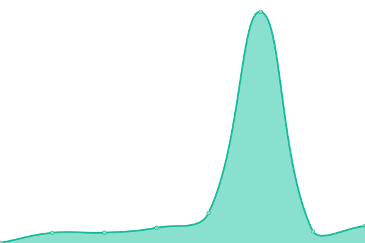
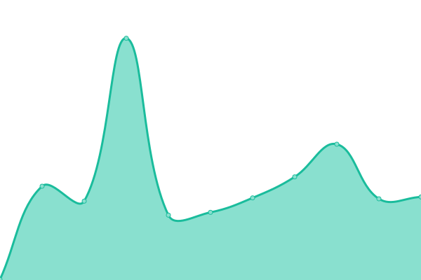

# [📈 Live Status](https://upptime.github.io/upptime): <!--live status--> **🟨 Partial outage**

This repository contains the open-source uptime monitor and status page for [Upptime](https://upptime.js.org), powered by [Upptime](https://github.com/upptime/upptime).

With [Upptime](https://upptime.js.org), you can get your own unlimited and free uptime monitor and status page, powered entirely by a GitHub repository. We use [Issues](https://github.com/upptime/upptime/issues) as incident reports, [Actions](https://github.com/upptime/upptime/actions) as uptime monitors, and [Pages](https://upptime.github.io/upptime) for the status page.

<!--start: status pages-->
<!-- This summary is generated by Upptime (https://github.com/upptime/upptime) -->
<!-- Do not edit this manually, your changes will be overwritten -->

| URL                                              | Status  | History                                                                                                    | Response Time                                                                          | Uptime                                                                                                                                                                                                                               |
| ------------------------------------------------ | ------- | ---------------------------------------------------------------------------------------------------------- | -------------------------------------------------------------------------------------- | ------------------------------------------------------------------------------------------------------------------------------------------------------------------------------------------------------------------------------------ |
| [FastGit Home](https://fastgit.org)              | 🟩 Up   | [fast-git-home.yml](https://github.com/FastGitORG/uptime/commits/master/history/fast-git-home.yml)         |  705ms     |          |
| [FastGit Archive](https://archive.fastgit.org)   | 🟩 Up   | [fast-git-archive.yml](https://github.com/FastGitORG/uptime/commits/master/history/fast-git-archive.yml)   |  380ms  |    |
| [FastGit Document](https://doc.fastgit.org)      | 🟩 Up   | [fast-git-document.yml](https://github.com/FastGitORG/uptime/commits/master/history/fast-git-document.yml) |  697ms |  |
| [FastGit Download](https://download.fastgit.org) | 🟥 Down | [fast-git-download.yml](https://github.com/FastGitORG/uptime/commits/master/history/fast-git-download.yml) |  0ms   |    |
| [FastGit Hub](https://hub.fastgit.org)           | 🟩 Up   | [fast-git-hub.yml](https://github.com/FastGitORG/uptime/commits/master/history/fast-git-hub.yml)           |  178ms      |            |
| [FastGit Status](https://status.fastgit.org)     | 🟩 Up   | [fast-git-status.yml](https://github.com/FastGitORG/uptime/commits/master/history/fast-git-status.yml)     |  816ms   |      |

<!--end: status pages-->

[**Visit our status website →**](https://upptime.github.io/upptime)

## 📄 License

- Code: [MIT](./LICENSE) © [Upptime](https://upptime.js.org)
- Data in the `./history` directory: [Open Database License](https://opendatacommons.org/licenses/odbl/1-0/)
