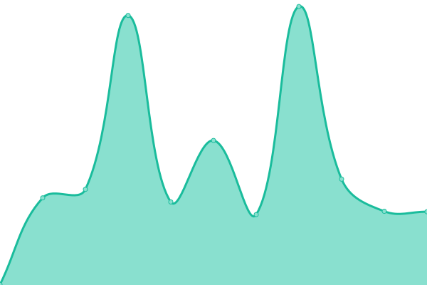

# [📈 Live Status](https://upptime.github.io/upptime): <!--live status--> **🟧 Partial outage**

This repository contains the open-source uptime monitor and status page for [Upptime](https://upptime.js.org), powered by [Upptime](https://github.com/upptime/upptime).

With [Upptime](https://upptime.js.org), you can get your own unlimited and free uptime monitor and status page, powered entirely by a GitHub repository. We use [Issues](https://github.com/upptime/upptime/issues) as incident reports, [Actions](https://github.com/upptime/upptime/actions) as uptime monitors, and [Pages](https://upptime.github.io/upptime) for the status page.

<!--start: status pages-->
<!-- This summary is generated by Upptime (https://github.com/upptime/upptime) -->
<!-- Do not edit this manually, your changes will be overwritten -->
<!-- prettier-ignore -->
| URL | Status | History | Response Time | Uptime |
| --- | ------ | ------- | ------------- | ------ |
| [FastGit Home](https://fastgit.org) | 🟥 Down | [fast-git-home.yml](https://github.com/FastGitORG/uptime/commits/master/history/fast-git-home.yml) | 

 774ms
     
 | 

   

| [FastGit Archive](https://archive.fastgit.org) | 🟥 Down | [fast-git-archive.yml](https://github.com/FastGitORG/uptime/commits/master/history/fast-git-archive.yml) | 

 1015ms
     
 | 

   

| [FastGit Document](https://doc.fastgit.org) | 🟥 Down | [fast-git-document.yml](https://github.com/FastGitORG/uptime/commits/master/history/fast-git-document.yml) | 

 694ms
     
 | 

   

| [FastGit Download](https://download.fastgit.org) | 🟩 Up | [fast-git-download.yml](https://github.com/FastGitORG/uptime/commits/master/history/fast-git-download.yml) | 

 766ms
     
 | 

   

| [FastGit Hub](https://hub.fastgit.org) | 🟩 Up | [fast-git-hub.yml](https://github.com/FastGitORG/uptime/commits/master/history/fast-git-hub.yml) | 

 282ms
     
 | 

   

| [FastGit Raw](https://raw.fastgit.org) | 🟩 Up | [fast-git-raw.yml](https://github.com/FastGitORG/uptime/commits/master/history/fast-git-raw.yml) | 

 230ms
     
 | 

   

| [FastGit Status](https://status.fastgit.org) | 🟩 Up | [fast-git-status.yml](https://github.com/FastGitORG/uptime/commits/master/history/fast-git-status.yml) | 

 719ms
     
 | 

   

| [GitHub](https://github.com) | 🟩 Up | [git-hub.yml](https://github.com/FastGitORG/uptime/commits/master/history/git-hub.yml) | 

 40ms
     
 | 

   

<!--end: status pages-->

[**Visit our status website →**](https://upptime.github.io/upptime)

## 📄 License

- Code: [MIT](./LICENSE) © [Upptime](https://upptime.js.org)
- Data in the `./history` directory: [Open Database License](https://opendatacommons.org/licenses/odbl/1-0/)
